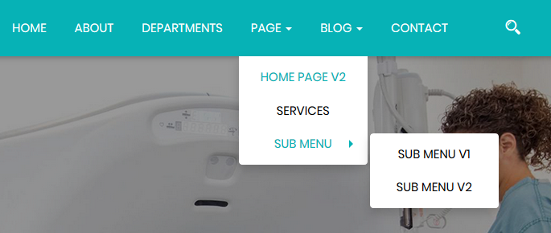
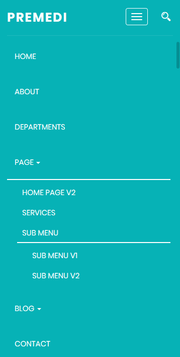

# Site Navigation





### Site Navigation HTML Code {#site-navigation-html-code}

The below code can be found in all HTML pages that are included with the theme. code will be placed from 222th to 257th line of each page.

```markup
<ul class="nav navbar-nav underline">
    <li class=" active "><a href="index.html" title="HOME" id="home">HOME</a></li>
    <li class=""><a href="about.html" title="ABOUT" id="about-page">ABOUT</a></li>
    <li class=""><a href="department.html" title="DEPARTMENTS" id="departments">DEPARTMENTS</a>
    </li>
    <li class=" dropdown "><a data-toggle="dropdown" href="#" title="PAGE" id="page">PAGE
        <span class="caret"></span></a>
        <ul class="dropdown-menu">
            <li class=""><a href="home-v2.html" title="HOME PAGE V2" id="home-2">HOME
                PAGE V2</a></li>
            <li class=""><a href="services.html" title="SERVICES"
                            id="services">SERVICES</a></li>
            <li class=" dropdown "><a data-toggle="dropdown" href="#" title="SUB MENU"
                                      id="sub-menu">SUB MENU <span class="caret"></span></a>
                <ul class="dropdown-menu">
                    <li class=""><a href="#" title="SUB MENU V1" id="sub-menu-v1">SUB
                        MENU V1</a></li>
                    <li class=""><a href="#" title="SUB MENU V2" id="sub-menu-v2">SUB
                        MENU V2</a></li>
                </ul>
            </li>
        </ul>
    </li>
    <li class=" dropdown "><a data-toggle="dropdown" href="#" title="BLOG"
                              id="blog-page">BLOG <span class="caret"></span></a>
        <ul class="dropdown-menu">
            <li class=""><a href="blog-list.html" title="BLOG LIST" id="blog-list-page">BLOG
                LIST</a></li>
            <li class=""><a href="blog-gird.html" title="BLOG GIRD" id="blog-gird">BLOG
                GIRD</a></li>
            <li class=""><a href="blog-single.html" title="SINGLE BLOG"
                            id="blog-single">SINGLE BLOG</a></li>
        </ul>
    </li>
    <li class=""><a href="contact.html" title="CONTACT" id="contact">CONTACT</a></li>
</ul>
```

